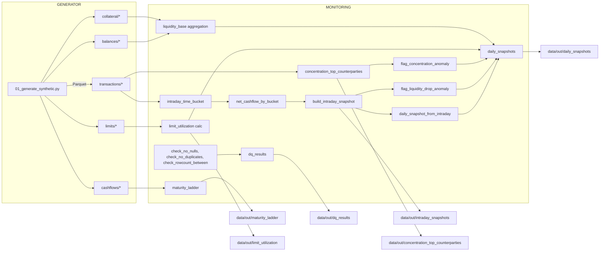

# Liquidity-Risk — Calculator + Monitoring (Full documentation)

An example project for banks: "Calculator + Monitoring" — compute and monitor liquidity on an intraday/hourly and daily basis from sources such as transactions, balances, future cashflows, collateral and settlement limits. Includes example Data Quality checks and anomaly flags.

This README explains installation, testing (unit + end-to-end local), expected outputs, and a high-level explanation of the system with diagrams to help understand the architecture and data flow.

---

## Table of Contents
- Prerequisites
- Installation (local)
- Run end-to-end (local) — generate synthetic data -> run monitoring
- Tests (pytest)
- Important config fields and tuning
- Project structure (module overview)
- Job-level explanation (flow + inputs/outputs)
- Expected outputs (examples)
- Performance tuning (partitioning, repartition, cache, bucketing)
- Diagram (data flow & components)
- Troubleshooting / Notes

---

## Prerequisites
- Python 3.10+
- Java 8+ (for Spark)
- Apache Spark 3.x (local mode for testing)
  - Use `spark-submit` for the jobs or run via `SparkSession` in the tests
- Python packages installed via `requirements.txt` (includes `pyspark`, `pyyaml`, `pytest`)
- Any OS supporting Spark/Python (Linux/Mac/WSL)

---

## Installation (local)
1. Clone the repo:
```bash
git clone https://github.com/KChanhom/Liquidity-Risk.git
cd Liquidity-Risk
```
2. Create a virtual environment and install dependencies:
```bash
python -m venv .venv
source .venv/bin/activate      # Mac / Linux
# .venv\Scripts\activate        # Windows PowerShell
pip install -r requirements.txt
```
3. Make sure `spark-submit` is available (or rely on the `pyspark` package inside the venv)

---

## Project layout (key folders)
- `src/liquidity_risk/` — core code (modules: datasets, features, dq, monitoring, io, spark, config, utils)
- `jobs/` — spark-submit entry points
  - `jobs/01_generate_synthetic.py` — generates synthetic Parquet inputs (transactions, balances, cashflows, collateral, limits)
  - `jobs/02_liquidity_monitoring.py` — main monitoring pipeline (intraday/daily snapshots, DQ, flags, utilizations)
- `configs/` — YAML configuration files (e.g., `configs/local.yml`)
- `data/` — local data folder (default: `data/raw`, `data/out`)
- `tests/` — pytest unit tests and SparkSession fixture
- `scripts/run_local.sh` — helper script for local E2E run

---

## Run end-to-end (local)
Note: check `configs/local.yml` and adjust `raw_path`/`out_path` before running (defaults to `data/raw` and `data/out`).

1) Generate synthetic data (write Parquet):
```bash
spark-submit --master "local[*]" jobs/01_generate_synthetic.py --config configs/local.yml
```

2) Run monitoring: intraday snapshots + daily snapshots + DQ checks + anomaly flags
```bash
spark-submit --master "local[*]" jobs/02_liquidity_monitoring.py --config configs/local.yml
```

Or run both steps via helper script:
```bash
bash scripts/run_local.sh configs/local.yml
```

Outputs will be written to `data/out/` according to the config file.

---

## Tests
Run unit tests with pytest:
```bash
pytest -q
```

Tests use `tests/conftest.py` to create a local SparkSession (config: `local[2]`, `spark.sql.shuffle.partitions=4`, timezone=UTC). The test suite covers DQ helpers, feature transforms and parts of the monitoring logic.

---

## Config (key fields)
Configuration is YAML (`configs/local.yml`). Important fields:
- `raw_path`: path for raw Parquet inputs (e.g. `data/raw`)
- `out_path`: path for pipeline outputs (e.g. `data/out`)
- `time_buckets`:
  - `timezone` (e.g. `UTC` or `Asia/Bangkok`)
  - `granularity` (`hour` or `minute`)
- `synthetic`: parameters for the synthetic generator (seed, as_of_date, days, tx_per_day, counterparties, accounts, currencies)
- `monitoring`: thresholds and parameters for flags:
  - `liquidity_drop_zscore_threshold`
  - `top_counterparties_n`
  - `concentration_share_threshold`
  - `limit_warning_threshold`, `limit_breach_threshold`
- `performance`: tuning
  - `cache_intermediate`, `repartition_by_date`

Example snippet:
```yaml
raw_path: data/raw
out_path: data/out
time_buckets:
  timezone: UTC
  granularity: hour
synthetic:
  seed: 42
  as_of_date: 2026-01-23
  days: 3
  tx_per_day: 20000
  counterparties: 250
  accounts: 2000
  currencies: ["THB"]
monitoring:
  liquidity_drop_zscore_threshold: 3.0
  top_counterparties_n: 10
  concentration_share_threshold: 0.20
performance:
  cache_intermediate: true
  repartition_by_date: 0
```

---

## How the system works (high-level)
1. Data generation (`jobs/01_generate_synthetic.py`)
   - Produces DataFrames for transactions, balances, future cashflows, collateral and limits and writes them as partitioned Parquet.

2. Monitoring pipeline (`jobs/02_liquidity_monitoring.py`)
   - Reads raw Parquet inputs and runs Data Quality checks (`src/liquidity_risk/dq.py`).
   - Builds intraday time buckets from transactions and computes net cashflow by bucket.
   - Builds intraday snapshots and flags liquidity drops by z-score.
   - Computes concentration metrics (top counterparties) and flags concentration anomalies.
   - Builds a maturity ladder from future cashflows.
   - Computes limit utilization (outflow per counterparty compared with settlement limits).
   - Compiles daily snapshot by joining intraday results with DQ results, concentrations, utilizations and balances/collateral.
   - Writes outputs as partitioned Parquet to `out_path`.

---

## Inputs/Outputs (expected)
Inputs (written by generator):
- `{raw_path}/transactions/` (partitioned by `value_date`)
- `{raw_path}/balances/` (partitioned by `as_of_date`)
- `{raw_path}/cashflows/` (partitioned by `as_of_date`)
- `{raw_path}/collateral/` (partitioned by `as_of_date`)
- `{raw_path}/limits/` (partitioned by `as_of_date`)

Outputs (written by monitoring):
- `{out_path}/dq_results/` — small parquet with (check_name, passed, details)
- `{out_path}/intraday_snapshots/` — intraday bucket snapshots with flags (partitioned by `value_date, currency`)
- `{out_path}/daily_snapshots/` — daily snapshot with anomaly flags (partitioned by `value_date`)
- `{out_path}/concentration_top_counterparties/` — top counterparties per date/currency
- `{out_path}/maturity_ladder/` — future cashflow ladder
- `{out_path}/limit_utilization/` — utilization per counterparty and currency

---

## Example outputs
1) dq_results (example)
```
check_name, passed, details
tx_no_nulls, True, ok
tx_pk_unique, True, ok
tx_volume_sanity, True, ok
cf_no_nulls, True, ok
...
```

2) daily_snapshots (example)
```
value_date: 2026-01-23
currency: THB
total_liquidity: 123456789.00
flag_liquidity_drop_any: False
flag_concentration: True
top1_share: 0.15
topN_share: 0.42
anomaly_flags: ["CONCENTRATION"]
max_utilization: 0.72
```

3) intraday_snapshots (example)
- columns: value_date, currency, bucket_start_ts, bucket_end_ts, net_cashflow, running_balance, flag_liquidity_drop

---

## Performance tuning notes
- Partitioning: write outputs partitioned by `value_date` and `currency` to reduce I/O and enable partition pruning.
- Repartition before wide aggregations: `tx_b = tx_b.repartition(N, "value_date")` to reduce skew when aggregating by date.
- Cache intermediate datasets that are reused (e.g., `tx_b`) and materialize with `count()` for demo patterns if memory allows.
- Bucketing: if you have a Hive metastore and repetitive read patterns, consider `bucketBy()` for join-heavy workloads.
- Tune Spark configs (`spark.sql.adaptive.enabled`, `spark.sql.shuffle.partitions`) according to cluster resources.

See `docs/performance.md` for examples.

---

## Diagram — data flow and components
(mermaid flowchart and ASCII fallback; matches the Thai README diagram)

Mermaid flowchart (if supported by viewer):



ASCII fallback (if mermaid not supported):

Generator -> raw Parquet:
- 01_generate_synthetic.py
  -> data/raw/transactions/
  -> data/raw/balances/
  -> data/raw/cashflows/
  -> data/raw/collateral/
  -> data/raw/limits/

Monitoring pipeline:
- Read raw Parquet
- DQ checks -> data/out/dq_results/
- transactions -> intraday buckets -> net cashflow -> intraday snapshots -> liquidity-drop flags -> data/out/intraday_snapshots/
- intraday -> daily snapshot builder + join (limits utilization, concentration flags, balances/collateral) -> data/out/daily_snapshots/
- cashflows -> maturity ladder -> data/out/maturity_ladder/
- concentration/top counterparties -> data/out/concentration_top_counterparties/
- limit utilization -> data/out/limit_utilization/

---

## Core function summaries
- `intraday_time_bucket(tx, timezone, granularity)` — map transaction timestamps to time buckets (hourly, etc.) considering timezone.
- `net_cashflow_by_bucket(tx_b)` — aggregate IN - OUT by bucket/date/currency.
- `build_intraday_snapshot(net_b)` — produce per-bucket snapshot with net cashflow and running metrics.
- `flag_liquidity_drop_anomaly(intraday, z_thresh)` — compute z-scores and flag buckets/days exceeding thresholds.
- `concentration_top_counterparties(tx_b, top_n)` — compute top N counterparties shares per date/currency.
- `flag_concentration_anomaly(conc_top, share_threshold)` — set flags when topN shares exceed threshold.
- DQ helpers: `check_no_nulls`, `check_no_duplicates`, `check_rowcount_between` — return `DqResult(check_name, passed, details)`.

---

## Troubleshooting & tips
- Java/Spark errors: check JAVA_HOME and Java version.
- Missing pyspark: verify venv and `pip install pyspark`.
- Timezone issues: ensure `cfg.time_buckets.timezone` and Spark session timezone are aligned.
- DQ failing checks: inspect `data/out/dq_results/` for `details` (null_counts or duplicate_rows).
- OOM / memory issues: reduce parallelism, decrease shuffle partitions or disable intermediate caching.

---

## Next steps / extension ideas
- Hook into real ingestion (Kafka / S3 / CDC)
- Add alerting (Slack / Email) when flags trigger
- Build a dashboard (Superset / Metabase) reading the Parquet / Hive tables
- Tune thresholds and benchmark on a real Spark cluster

---

End of file.