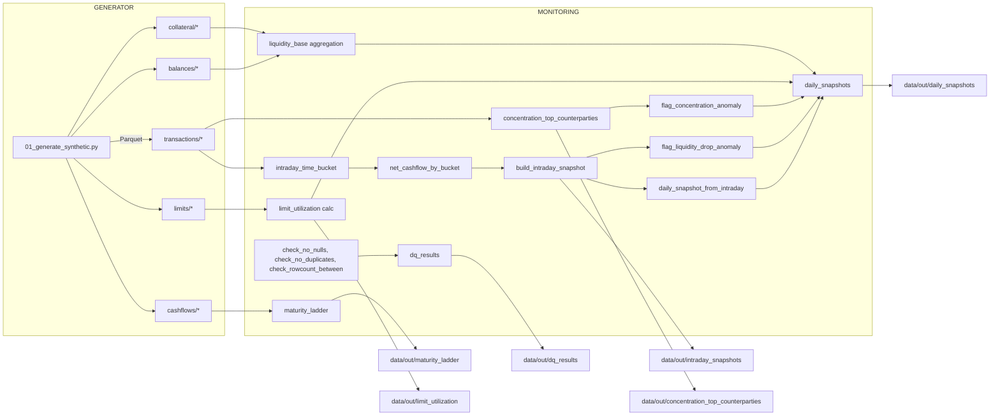

# Liquidity-Risk — Calculator + Monitoring (รายละเอียดฉบับสมบูรณ์)

โปรเจกต์ตัวอย่างสำหรับธนาคาร: “Calculator + Monitoring” — คำนวณและติดตามสภาพคล่อง (liquidity) รายชั่วโมง/รายวัน จากแหล่งข้อมูลเช่น ธุรกรรมเข้า-ออก (transactions), ยอดบัญชี (balances), cashflows ในอนาคต (future cashflows), collateral, และ settlement limits พร้อมตัวอย่าง Data Quality checks และการทำเครื่องหมาย anomaly/flag

เอกสารนี้อธิบายการติดตั้ง การรันทดสอบ (unit + end-to-end แบบ local) โครงสร้างผลลัพธ์ที่คาดหวัง และสรุปการทำงานของระบบพร้อม diagram เพื่อช่วยให้เข้าใจสถาปัตยกรรมและ data flow

---

## สารบัญ (Quick jump)
- ข้อกำหนดเบื้องต้น
- การติดตั้ง (local)
- การรัน end-to-end (local) — สร้างข้อมูลจำลอง → รัน monitoring
- การรันทดสอบ (pytest)
- ไฟล์ config ที่สำคัญ และค่าที่ปรับได้
- โครงสร้างโค้ด (module overview)
- คำอธิบายการทำงานของแต่ละ job (flow + inputs/outputs)
- ผลลัพธ์ที่คาดหวัง (ตัวอย่าง)
- การปรับแต่งประสิทธิภาพ (partitioning, repartition, cache, bucketing)
- Diagram (data flow & component)
- Troubleshooting / Notes

---

## ข้อกำหนดเบื้องต้น
- Python 3.10+
- Java 8+ (สำหรับ Spark)
- Apache Spark 3.x (ใช้ local mode สำหรับทดสอบ)
  - กระจายงานด้วย `spark-submit` หรือรันผ่าน `SparkSession` ใน tests
- แพ็กเกจ Python: ติดตั้งจาก `requirements.txt` (รวม `pyspark`, `pyyaml`, `pytest` เป็นต้น)
- ระบบปฏิบัติการใดก็ได้ที่รองรับ Spark/Python (Linux/Mac/WSL)

---

## การติดตั้ง (local)
1. โคลน repo:
   ```bash
   git clone https://github.com/KChanhom/Liquidity-Risk.git
   cd Liquidity-Risk
   ```
2. สร้าง virtual environment และติดตั้ง dependencies:
   ```bash
   python -m venv .venv
   source .venv/bin/activate      # Mac / Linux
   # .venv\Scripts\activate        # Windows PowerShell
   pip install -r requirements.txt
   ```
3. ตรวจสอบว่า `spark-submit` พร้อมใช้งาน (หรือให้ใช้งานผ่าน pyspark package ที่ติดตั้งใน venv)

---

## โครงสร้างโปรเจกต์ (สำคัญ)
- `src/liquidity_risk/` — โค้ดหลัก (modules: datasets, features, dq, monitoring, io, spark, config, utils)
- `jobs/` — entrypoints สำหรับ `spark-submit`
  - `jobs/01_generate_synthetic.py` — สร้างข้อมูลจำลอง (transactions, balances, cashflows, collateral, limits)
  - `jobs/02_liquidity_monitoring.py` — คำนวณ intraday/daily snapshots, DQ checks, anomaly flags, limit utilizations
- `configs/` — ไฟล์ YAML config (เช่น `configs/local.yml`)
- `data/` — โฟลเดอร์ผลลัพธ์ที่สร้างแบบ local (`data/out/` เป็นค่าเริ่มต้น)
- `tests/` — unit tests (pytest + fixture สำหรับ SparkSession)
- `scripts/run_local.sh` — helper script รัน E2E local (generate -> monitoring)

---

## การรัน end-to-end (local)
หมายเหตุ: ก่อนรัน ให้ตรวจสอบ `configs/local.yml` และปรับพาธ `raw_path`/`out_path` ตามต้องการ (ค่าเริ่มต้นมักอยู่ใน `data/raw` และ `data/out`)

1) สร้างข้อมูลจำลอง (transactions, balances, cashflows, collateral, limits) เป็น Parquet:
```bash
spark-submit --master "local[*]" jobs/01_generate_synthetic.py --config configs/local.yml
```

2) รัน monitoring: สร้าง intraday snapshots + daily snapshots + DQ checks + flags
```bash
spark-submit --master "local[*]" jobs/02_liquidity_monitoring.py --config configs/local.yml
```

หรือใช้สคริปต์เดียว:
```bash
bash scripts/run_local.sh configs/local.yml
```

เมื่อสำเร็จ ผลลัพธ์จะอยู่ในโฟลเดอร์ `data/out/` (ตาม config)

---

## การรันทดสอบ (unit tests)
รันทดสอบด้วย pytest:
```bash
pytest -q
```

ซึ่งจะเรียกใช้ `tests/conftest.py` เพื่อสร้าง SparkSession แบบ local (config: `local[2]`, `spark.sql.shuffle.partitions=4`, timezone=UTC) — tests ใน repo จะตรวจสอบฟังก์ชันหลัก เช่น DQ checks, feature transforms, และบางส่วนของ monitoring logic

---

## ไฟล์ config (ตัวอย่างและ key fields)
ไฟล์ config เป็น YAML (ตัวอย่าง: `configs/local.yml`) — คีย์สำคัญ:
- `raw_path` — พาธเก็บ raw Parquet (เช่น `data/raw`)
- `out_path` — พาธเก็บผลลัพธ์ (เช่น `data/out`)
- `time_buckets`:
  - `timezone` — เช่น `UTC` หรือ `Asia/Bangkok`
  - `granularity` — `hour` หรือ `minute` (ใช้กับ intraday bucket)
- `synthetic` — พารามิเตอร์สำหรับ generator (seed, as_of_date, days, tx_per_day, counterparties, accounts, currencies)
- `monitoring` — thresholds และพารามิเตอร์สำหรับ flag:
  - `liquidity_drop_zscore_threshold`
  - `top_counterparties_n`
  - `concentration_share_threshold`
  - `limit_warning_threshold`, `limit_breach_threshold`
- `performance` — พารามิเตอร์ tuning: `cache_intermediate`, `repartition_by_date`

ตัวอย่าง:
```yaml
raw_path: data/raw
out_path: data/out
time_buckets:
  timezone: UTC
  granularity: hour
synthetic:
  seed: 42
  as_of_date: 2026-01-23
  days: 3
  tx_per_day: 20000
  counterparties: 250
  accounts: 2000
  currencies: ["THB"]
monitoring:
  liquidity_drop_zscore_threshold: 3.0
  top_counterparties_n: 10
  concentration_share_threshold: 0.20
performance:
  cache_intermediate: true
  repartition_by_date: 0
```

---

## คำอธิบายการทำงานของระบบ (high-level)
1. Data generation (jobs/01_generate_synthetic.py)
   - สร้าง DataFrame จำลอง: transactions, balances, cashflows (future), collateral, limits
   - เขียนเป็น Parquet partitioned (เช่น transactions partitioned by `value_date`)
   - ใช้ `src/liquidity_risk/datasets/synthetic.py` (generator) เพื่อควบคุม schema และ deterministic seed

2. Monitoring pipeline (jobs/02_liquidity_monitoring.py)
   - อ่าน raw Parquet จาก `raw_path`
   - รันชุด Data Quality checks (ใน `src/liquidity_risk/dq.py`): null checks, duplicate checks, rowcount sanity
   - สร้าง intraday time buckets จาก transactions (`intraday_time_bucket`) แล้วคำนวณ `net_cashflow_by_bucket`
   - สร้าง intraday snapshots (aggregation ของ cashflow ต่อ time bucket) และระบุ liquidity drop anomaly (z-score)
   - คำนวณ concentration (top counterparties share) และ flag เมื่อ share สูงกว่าธreshold
   - สร้าง maturity ladder จาก cashflows ในอนาคต (buckets ตาม maturity_date)
   - คำนวณ limit utilization (รวม outflow ต่อ counterparty ต่อวัน แล้วเทียบกับ settlement limit)
   - รวบรวมผลลัพธ์เป็น daily snapshot ร่วมกับ flags และ DQ results
   - เขียน outputs เป็น Parquet partitioned ไปยัง `out_path`

---

## Input / Output (paths & expected datasets)
Inputs (จาก jobs/01_generate_synthetic.py → `cfg.raw_path`):
- `{raw_path}/transactions/` (Parquet partitioned by `value_date`)
- `{raw_path}/balances/` (partition by `as_of_date`)
- `{raw_path}/cashflows/` (partition by `as_of_date`)
- `{raw_path}/collateral/` (partition by `as_of_date`)
- `{raw_path}/limits/` (partition by `as_of_date`)

Outputs (เขียนโดย jobs/02_liquidity_monitoring.py → `cfg.out_path`):
- `{out_path}/dq_results/` — small parquet ที่เก็บผล DQ checks (columns: check_name, passed, details)
- `{out_path}/intraday_snapshots/` — intraday bucket snapshots + liquidity-drop flags (partitioned by `value_date, currency`)
- `{out_path}/daily_snapshots/` — daily snapshot + combined anomaly flags (partitioned by `value_date`)
- `{out_path}/concentration_top_counterparties/` — top counterparties per date/currency
- `{out_path}/maturity_ladder/` — future cashflow ladder (partitioned)
- `{out_path}/limit_utilization/` — utilization per counterparty/settlement limit (partitioned)

ตัวอย่าง schema (คร่าว ๆ):
- transactions: tx_id, event_ts, value_date, account_id, counterparty_id, currency, direction (IN/OUT), amount, ...
- cashflows: cf_id, as_of_date, maturity_date, counterparty_id, currency, direction, amount, ...
- balances: as_of_date, account_id, currency, balance
- collateral: as_of_date, collateral_id, counterparty_id, currency, market_value, haircut_pct, eligible_lcr
- limits: as_of_date, counterparty_id, limit_type, currency, limit_amount

---

## ตัวอย่างผลลัพธ์ (ตัวอย่างข้อความ/ตาราง)
1) dq_results (ตัวอย่าง)
```
check_name, passed, details
tx_no_nulls, True, ok
tx_pk_unique, True, ok
tx_volume_sanity, True, ok
cf_no_nulls, True, ok
...
```

2) daily_snapshots (ตัวอย่าง row)
```
value_date: 2026-01-23
currency: THB
total_liquidity: 123456789.00
flag_liquidity_drop_any: False
flag_concentration: True
top1_share: 0.15
topN_share: 0.42
anomaly_flags: ["CONCENTRATION"]
max_utilization: 0.72
```

3) intraday_snapshots (ตัวอย่าง)
- columns: value_date, currency, bucket_start_ts, bucket_end_ts, net_cashflow, running_balance, flag_liquidity_drop (per bucket)

---

## การปรับแต่งประสิทธิภาพ (performance notes)
- Partitioning: เขียนผลเป็น Parquet partitioned (value_date, currency) เพื่อให้ query เลือกอ่านเฉพาะวันที่/สกุลเงินที่ต้องการ ลด I/O
- Repartition before wide aggregations: `tx_b = tx_b.repartition(N, "value_date")` — ลด skew ในการ aggregate ข้อมูลตาม date เมื่อ data โต
- Caching intermediate: `cache()` dataset ที่ใช้ซ้ำ (เช่น tx_b) และ materialize ด้วย `count()` เพื่อเร่งงาน downstream (ใช้ถ้าหน่วยความจำเพียงพอ)
- Bucketing (advanced): ถ้ามี Hive metastore/warehouse และ workloads ที่อ่านซ้ำ ๆ สามารถใช้ `bucketBy()` สำหรับ join-heavy workloads (ต้อง spark catalog เป็น hive)
- Spark adaptive/executor configs: ปรับ `spark.sql.adaptive.enabled`, `spark.sql.shuffle.partitions`, และ memory configs ตาม cluster

ดูตัวอย่างการใช้งาน performance ใน `docs/performance.md`

---

## Diagram — Data Flow and Components

Mermaid flowchart (หาก viewer รองรับ mermaid จะเรนเดอร์; ถ้าไม่ ให้ดู ASCII fallback ด้านล่าง)



ASCII fallback (if mermaid ไม่สามารถเรนเดอร์):

Generator -> raw Parquet:
- 01_generate_synthetic.py
  -> data/raw/transactions/
  -> data/raw/balances/
  -> data/raw/cashflows/
  -> data/raw/collateral/
  -> data/raw/limits/

Monitoring pipeline:
- Read raw Parquet
- DQ checks -> data/out/dq_results/
- transactions -> intraday buckets -> net cashflow -> intraday snapshots -> liquidity-drop flags -> data/out/intraday_snapshots/
- intraday -> daily snapshot builder + join (limits utilization, concentration flags, balances/collateral) -> data/out/daily_snapshots/
- cashflows -> maturity ladder -> data/out/maturity_ladder/
- concentration/top counterparties -> data/out/concentration_top_counterparties/
- limit utilization -> data/out/limit_utilization/

---

## คำอธิบายเชิงลึกของฟังก์ชันหลัก (สรุป)
- `intraday_time_bucket(tx, timezone, granularity)`:
  - แปลง timestamp ของ transaction เป็น bucket (เช่น hourly) โดยคำนึงถึง timezone
  - คืน DataFrame ที่มี `bucket_start`, `bucket_end`, `value_date`, `currency`, `direction`, `amount`, `counterparty_id`, ฯลฯ

- `net_cashflow_by_bucket(tx_b)`:
  - aggregate จำนวนเงิน (IN - OUT) ต่อ bucket/value_date/currency

- `build_intraday_snapshot(net_b)`:
  - สร้าง snapshot per bucket ที่รวม net cashflow และ running metrics (เช่น cumulative net)

- `flag_liquidity_drop_anomaly(intraday, z_thresh)`:
  - คำนวณ z-score ของ net cashflow/changes และตั้ง flag ถ้า zscore > threshold

- `concentration_top_counterparties(tx_b, top_n)`:
  - สำหรับแต่ละ date/currency คำนวณสัดส่วน top N counterparties และคืนตาราง ranking พร้อม shares

- `flag_concentration_anomaly(conc_top, share_threshold)`:
  - ตั้ง flag เมื่อ topN_share เกิน threshold

- DQ checks (`check_no_nulls`, `check_no_duplicates`, `check_rowcount_between`):
  - ฟังก์ชันที่คืนผลเป็น `DqResult(check_name, passed, details)` และจะเขียนเป็น parquet ขนาดเล็ก

---

## ตัวอย่างการดีบัก / Troubleshooting
- หาก `spark-submit` ขึ้น error เกี่ยวกับ Java: ตรวจสอบ JAVA_HOME และ Java version
- หาก `pyspark` ไม่พบ: ตรวจสอบ virtualenv และ pip install `pyspark`
- ถ้า timezone ผิดพลาด (buckets เลื่อนไป): ตรวจสอบ `cfg.time_buckets.timezone` และ `spark.conf.set("spark.sql.session.timeZone", tz)`
- ถ้า DQ checks ล้มเหลว: เปิดดู `data/out/dq_results/` เพื่ออ่าน `details` ของ check (null_counts หรือ duplicate_rows)
- Memory / OOM: ลด parallelism / ลดจำนวน partitions หรือเปิด `cache_intermediate: false` ใน config

---

## Notes & Best Practices
- สำหรับ production: อย่าใช้ `count()` เพื่อ materialize cache บ่อย ๆ ใน pipeline ขนาดใหญ่ — ใช้เมื่อจำเป็นเท่านั้น
- Bucketing มีประโยชน์เมื่อทำซ้ำและอ่านตารางเดิมหลายครั้ง (ต้องมี Hive metastore)
- เก็บ schema และ versioning ของ data (eg. dataset version) เพื่อให้ reproducible
- ปรับ thresholds (z-score, concentration share, limit thresholds) ตามพฤติกรรมจริงของธุรกิจ

---

## ที่มาของตัวอย่างโค้ด (ไฟล์สำคัญ)
- jobs/01_generate_synthetic.py — สร้าง Parquet ข้อมูลจำลอง
- jobs/02_liquidity_monitoring.py — pipeline หลัก
- src/liquidity_risk/dq.py — Data Quality checks helpers
- src/liquidity_risk/features.py — transforms สำหรับ concentration, net_cashflow, maturity ladder
- tests/ — pytest unit tests + conftest fixture สำหรับ SparkSession

---

## ถัดไป / ขยายงานได้อย่างไร
- เชื่อมต่อกับ real data source (CDC, Kafka, S3)
- เพิ่ม alerting/notification (เช่นส่ง Slack/Email เมื่อ flag เกิด)
- เพิ่ม dashboard (e.g., Superset/Metabase) อ่านจาก Parquet หรือ Hive tables
- ทำ parameter tuning และ benchmarking บน cluster ขนาดจริง

---